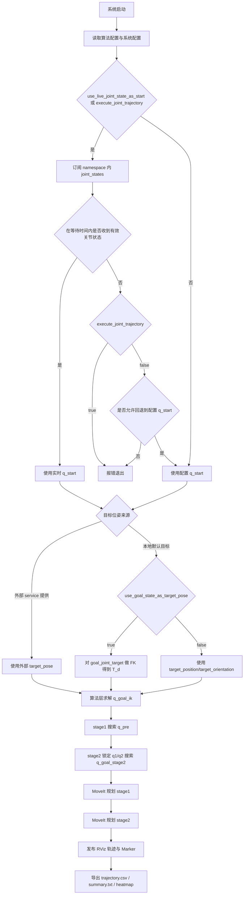

# trunk_two_stage_planner

基于 MoveIt2 / RViz 的 trunk 两阶段规划工程系统。

## 项目概述

本工程面向一个 4 自由度 trunk 机构的两阶段规划问题。目标不是单次把 `trunk_group` 从起点直接规划到终点，而是把整体过程拆成两个阶段：

- 第一阶段：笛卡尔预备态规划
- 第二阶段：最终位姿恢复

这样拆分的原因是：

- 第一阶段主要负责中间过程的空间运动形态控制，用于降低本体碰撞风险并保持胸部稳定
- 第二阶段主要负责从预备态恢复到最终目标位姿
- 第一阶段的终点不能只看几何投影关系，还必须满足第二阶段的恢复性要求

当前工程使用两个 MoveIt planning groups：

- `stage1_group`
- `stage2_group`

它们在 SRDF 层面共享同一条 trunk 运动链，但在工程层面承载不同的阶段逻辑与约束。

---

## 系统入口总览

当前包内有 5 类入口，建议按用途区分使用：

| 入口 | 名称 | 作用 | 是否依赖 MoveIt 规划 |
|---|---|---|---|
| 主系统 | `two_stage_planner_system` | 按本地参数执行一次完整两阶段规划 | 是 |
| Service 系统 | `two_stage_planner_service` | 对上层开放目标位姿请求接口 | 是 |
| 离线分析工具 | `two_stage_planner_analysis_tool` | 离线算法评估、heatmap、summary 导出 | 否 |
| FK 工具 | `fk_pose_from_joint` | 关节空间目标转目标位姿 | 否 |
| IK 工具 | `ik_joint_from_pose` | 目标位姿转关节空间目标 | 否 |

建议：

- 本地调试主流程：用 `two_stage_planner_system`
- 上层系统集成：用 `two_stage_planner_service`
- 调参分析：用 `two_stage_planner_analysis_tool`
- 生成/校验配置：用 `fk_pose_from_joint` 和 `ik_joint_from_pose`

---

## 当前系统架构

当前工程按功能分为四层：

- MoveIt 配置层：`trunk_configure`
- 算法层：`trunk_two_stage_planner` 中的几何、IK、`q_pre` 搜索与恢复性验证
- 调度层：`TwoStagePlannerManager`
- 可视化与调试层：`DisplayTrajectory`、RViz marker、CSV/summary 导出

核心文件职责：

- `include/trunk_two_stage_planner/two_stage_planner_manager.hpp`
  - 工程主入口类声明
- `src/two_stage_planner_manager.cpp`
  - 两阶段调度、MoveIt 规划调用、轨迹显示、marker 发布、阶段衔接
- `include/trunk_two_stage_planner/robot_kinematics_helper.hpp`
  - RobotModel / RobotState / FK / IK / joint axis 查询
- `src/robot_kinematics_helper.cpp`
  - 模型加载、KDL IK 接入、世界坐标系关节轴计算
- `include/trunk_two_stage_planner/two_stage_planner.hpp`
  - 两阶段算法层接口
- `src/two_stage_planner.cpp`
  - `q_goal` 求解、`q_pre` 搜索、第二阶段恢复性评估
- `include/trunk_two_stage_planner/trajectory_utils.hpp`
  - 轨迹导出、summary 和 heatmap 导出接口
- `src/trajectory_utils.cpp`
  - CSV / summary / geometry_points 导出实现
- `src/fk_pose_from_joint_main.cpp`
  - 关节空间目标转目标位姿（FK）工具
- `src/ik_joint_from_pose_main.cpp`
  - 目标位姿转关节空间目标（IK）工具
- `src/two_stage_planner_service_main.cpp`
  - 对上层开放的 Service 入口

---

## 输入与输出

### 输入

系统有两类输入：

#### 1. 起点输入

起点本质上是关节状态 `q_start`，当前优先级为：

1. 实时 `joint_states`（默认解析为 `/trunk_robot/joint_states`）
2. 配置文件中的 `q_start`（仅在允许回退时）

#### 2. 目标输入

目标位姿 `T_d` 有三种来源：

1. 外部 service 请求（若 `use_external_target=true`）
2. `goal_joint_target` 的 FK（若 `use_goal_state_as_target_pose=true`）
3. `target_position + target_orientation`（若 `use_goal_state_as_target_pose=false`）

### 输出

系统当前输出：

- 两阶段规划轨迹（MoveIt 内部轨迹 + RViz 显示）
- `trajectory.csv`
- `summary.txt`
- `stage1_heatmap.csv`
- `geometry_points.csv`

注意：

- 当前主系统默认是“规划 + 显示 + 导出 + 发送控制器执行”
- 规划成功后一定会发布完整 `JointTrajectory`
- 是否继续发送 `FollowJointTrajectory` goal 由 `execute_joint_trajectory` 控制
- 接入真实硬件时，控制器安全策略与硬件闭环仍需单独联调验证

---

## 起点与终点的确定逻辑

### 1. 起点如何确定

当前系统支持“实时起点模式”。

若：

- `use_live_joint_state_as_start: true`

则系统会：

1. 订阅 `joint_states_topic`（默认 `joint_states`，随 `robot_namespace` 解析）
2. 按 `expected_joint_names` 校验并重排得到当前关节状态
3. 在 `joint_state_wait_timeout_sec` 时间内等待有效状态
4. 若成功收到，则使用实时关节状态作为本次规划起点
5. 若未收到：
   - `execute_joint_trajectory: true` -> 拒绝执行，避免轨迹起点与控制器当前状态不一致
   - `execute_joint_trajectory: false` 且 `allow_start_state_fallback_to_config: true` -> 回退到配置 `q_start`
   - `allow_start_state_fallback_to_config: false` -> 直接报错退出

实时起点会额外执行 joint state 安全校验：

- `strict_joint_states: true`：`JointState.name` 必须与 `expected_joint_names` 完全一致；缺少期望关节或包含未知关节都会拒绝该消息
- `strict_joint_states: false`：只要求包含所有 `expected_joint_names`；若包含未知关节且 `warn_unknown_joints: true`，会打印 warning 但仍使用期望关节
- 任何期望关节位置为 `NaN/Inf`，或 `name/position` 长度不一致，都会拒绝该消息

若：

- `use_live_joint_state_as_start: false`

且 `execute_joint_trajectory: false`，则系统直接使用配置文件中的：

- `q_start`

若 `execute_joint_trajectory: true`，系统仍会强制等待有效实时关节状态，并用它作为规划起点。

### 2. 终点位姿如何确定

若使用主系统或 service 本地默认目标逻辑，终点位姿按以下规则确定：

#### 模式 A：由关节目标 FK 推导

- `use_goal_state_as_target_pose: true`
- 终点位姿由 `goal_joint_target` 经 FK 得到

#### 模式 B：直接指定位姿

- `use_goal_state_as_target_pose: false`
- 终点位姿直接使用：
  - `target_position`
  - `target_orientation`

#### 模式 C：外部 service 位姿优先

若 service 请求中：

- `use_external_target: true`

则直接使用外部传入的：

- `target_position`
- `target_orientation`

此时不会再用本地默认目标逻辑。

---

## 两阶段算法流程

### 方法层定义

当前主线方法定义为：

**带第二阶段恢复性约束的两阶段笛卡尔预备态规划**

流程如下：

1. 输入最终目标位姿 `T_d`
2. 求最终 IK 解 `q_goal_ik`
3. 构造第一阶段受限候选族  
   `q_pre(q1, q2) = [q1, q2, q1 + q2, q4_fix]`
4. 对每个候选 `q_pre`，先检查：
   - 在固定 `q1, q2` 下，仅允许 `q3, q4` 变化时，第二阶段是否能恢复最终目标位姿
5. 仅在满足恢复性阈值的候选子集内，再综合比较：
   - 投影几何引导量
   - 离起点偏移
   - 关节限位
   - 安全裕度
6. 选出最终 `q_pre`
7. 第一阶段规划到 `q_pre`
8. 第二阶段从第一阶段终点继续，恢复到最终目标位姿

### 算法流程图



### 代价函数与排序规则

当前实现里的代价函数分为三层：**stage1 完整加权代价**、**stage2 位姿恢复误差**、**stage2 词典序选择规则**。

#### 1. Stage1 完整加权代价

当不存在满足恢复性阈值的候选时，使用：

\[
J_{\text{stage1}}
=
w_1 \cdot e_{\text{proj}}^2
+ w_2 \cdot e_{\text{stage2-pos}}^2
+ w_3 \cdot e_{\text{start}}
+ w_4 \cdot e_{\text{limit}}
\]

其中：

- `w1`：投影几何引导权重
- `w2`：第二阶段位置可恢复性权重
- `w3`：离起点偏移权重
- `w4`：关节限位/安全裕度权重

#### 2. Stage2 恢复性综合误差

用于判断某个 `q_pre` 是否进入“恢复性可行候选子集”：

\[
e_{\text{stage2-pose}}
=
stage2\_pose\_wp \cdot e_{\text{pos}}^2
+ stage2\_pose\_wR \cdot e_{\text{rot}}^2
\]

其中：

- `stage2_pose_wp`：位置恢复误差权重
- `stage2_pose_wR`：姿态恢复误差权重
- `stage2_pose_epsilon`：进入可行子集的阈值

一旦候选满足 `e_stage2-pose < stage2_pose_epsilon`，stage1 排序会切换为“过滤代价”：

\[
J_{\text{filtered}}
=
w_1 \cdot e_{\text{proj}}^2
+ w_3 \cdot e_{\text{start}}
+ w_4 \cdot e_{\text{limit}}
\]

也就是**不再继续用 `w2` 比较已过关的候选**。

#### 3. Stage2 最终目标的词典序规则

第二阶段最终不是简单按一个加权和拍板，而是按以下优先级依次比较：

1. 综合位姿误差 `pose_err`
2. 位置误差 `pos_err`
3. 姿态误差 `ori_err`
4. `q3/q4` 相对 `q_goal_ik` 的偏移 `q34_bias`

因此，stage2 的核心原则是：

- 先保证最终位姿恢复
- 再比较位置/姿态细节
- 最后才考虑是否更接近某个关节参考解

#### 4. IK 多解的工程排序规则

若同一目标位姿存在多个 IK 候选，当前按下式选择一个工程最优解：

\[
J_{\text{ik}}
=
\|q - q_{\text{start}}\|^2
+ ik\_limit\_penalty\_weight \cdot e_{\text{limit}}
\]

即：

- 优先选择离当前起点更近的分支
- 同时偏好更远离关节限位的解

详细解释、变量定义和设计意图请直接查看：

- `src/two_stage_planner.cpp` 中相关函数注释

### 投影点的角色

投影点现在只是第一阶段预备态终点的**几何引导量之一**，不再是唯一目标。当前算法已经验证出：

- 投影最优的候选不一定等于第二阶段恢复最优的候选
- 如果只看投影，不足以保证最终阶段可恢复

### 第一阶段为何不是直接最终位姿规划

第一阶段的核心不是“直接朝最终位姿逼近”，而是保证中间过程的空间形态合理，例如：

- 胸部主轴稳定
- 本体中间过程不过分摆动
- 后续阶段仍然可恢复

因此第一阶段必须被理解为“笛卡尔预备态规划”，而不是单纯的终点关节目标规划。

---

## 当前工程实现现状

这里必须严格区分“方法定义”和“当前实现层级”。

### 已实现

- 目标位姿 `T_d` 到最终 IK 解 `q_goal_ik` 的求解
- 基于 namespace 内 `joint_states` 的实时起点读取（可选回退到配置 `q_start`）
- 第一阶段候选预备态 `q_pre` 搜索
- 第二阶段完整位姿恢复性验证
- `stage1_group / stage2_group` 两阶段 MoveIt 规划调度
- RViz 轨迹显示
- RViz marker 显示关键几何点与阶段路径
- 两阶段轨迹导出
- summary / heatmap / geometry_points 导出
- Service 目标位姿输入
- FK / IK 小工具

### 当前仍是工程近似的地方

- `stage1_group` / `stage2_group` 不是物理上拆开的链，只是工程入口分组
- `q3 = q1 + q2` 没有在 MoveIt 中实现为原生硬约束，而是由算法层用于候选构造
- 当前起点虽然已经可优先来自实时 `joint_states`，但仍默认以关节状态作为上层规划起点，而不是单独基于“当前末端位姿”直接起算
- 第一阶段还不是完整的一阶段连续笛卡尔过程约束优化器
- 第一阶段当前采用的是工程近似：
  - 先由算法层求 `q_pre`
  - MoveIt 规划到 `q_pre`
  - 可选：参考点笛卡尔导向（当前为低风险工程版）
  - 优先尝试 upright path constraint
  - 若失败则回退为无 path constraint 的 `stage1_group` 规划
- 第二阶段当前采用的是工程近似：
  - 算法层先给出 `q_goal_stage2`
  - MoveIt 再规划到该 joint target
  - 对 `q1 / q2` 加 joint constraints 近似固定前两轴

### 当前不能夸大的地方

当前版本**不能**被描述为：

- 已经完成完整的一阶段连续笛卡尔过程约束规划
- 已经原生支持 `q3 = q1 + q2` 硬约束
- 已经原生实现“仅由 q3、q4 完成恢复”的 MoveIt 模型层约束
- 已经完成真实硬件闭环执行链路（当前仍以 MoveIt 规划、显示、导出和 FakeSystem 联调为主）

它目前是一个：

**可运行的工程版第一版系统**

---

## 当前系统边界

当前包负责：

- 从起点和目标位姿出发完成两阶段规划
- 输出可视化轨迹和调试数据
- 输出完整 `trajectory_msgs/msg/JointTrajectory`
- 可选将完整轨迹作为 `FollowJointTrajectory` goal 发给 `ros2_control`
- 给上层提供目标位姿请求接口

当前包默认**不负责**：

- 真实硬件闭环控制
- 将 stage1/2 作为严格独立的物理链执行

说明：

- 当前版本已经支持将拼接后的完整轨迹直接发送到 `ros2_control` 的 `FollowJointTrajectory` action。
- 但当前默认底层仍然是 FakeSystem / mock controller 联调环境，不应直接等同于真实硬件闭环能力。

---

## 目录结构说明

当前主线包：

- `trunk_two_stage_planner/`
  - `include/trunk_two_stage_planner/`
    - `robot_kinematics_helper.hpp`
    - `two_stage_planner.hpp`
    - `two_stage_planner_manager.hpp`
    - `trajectory_utils.hpp`
    - `types.hpp`
  - `src/`
    - `robot_kinematics_helper.cpp`
    - `two_stage_planner.cpp`
    - `two_stage_planner_manager.cpp`
    - `trajectory_utils.cpp`
    - `system_main.cpp`
    - `analysis_tool_main.cpp`
    - `fk_pose_from_joint_main.cpp`
    - `ik_joint_from_pose_main.cpp`
    - `two_stage_planner_service_main.cpp`
  - `srv/`
    - `PlanToPose.srv`
  - `config/`
    - `two_stage_system_params.yaml`
    - `two_stage_system.rviz`
    - `two_stage_system_moveit.rviz`
    - `two_stage_system_stable.rviz`
    - `README.md`
    - `tools/`
      - `two_stage_planner_analysis_tool.yaml`
  - `launch/`
    - `two_stage_planner_system.launch.py`
    - `two_stage_planner_service.launch.py`
  - `scripts/`
    - `example_plan_to_pose_client`
  - `README.md`

支撑包：

- `trunk_configure/`
  - MoveIt2 配置、SRDF、kinematics、OMPL、launch
- `robot_model/`
  - URDF、mesh、模型资源

保留但降级为 legacy 的包：

- `trunk_moveit_cpp_demo/`
- `trunk_moveit/`

---

## 关键配置文件

### 主配置

- `config/two_stage_system_params.yaml`

负责：

- 起点与目标位姿来源
- 算法参数
- MoveIt 运行参数0
- 实时起点模式
- 导出与话题

### 配置文档

- `config/README.md`

建议你把它当成：

- 参数字典
- 常见问题定位表
- service/example 与实时起点模式的配置导航

### RViz 配置

- `config/two_stage_system_moveit.rviz`
  - 默认 MotionPlanning 动画版
- `config/two_stage_system_stable.rviz`
  - 备用轻量稳定版
- `config/two_stage_system.rviz`
  - 兼容保留的轻量布局

只影响显示，不改算法行为。

---

## 如何编译

建议直接编译主线包及其配置包：

```bash
cd ~/ws_moveit2
source /opt/ros/humble/setup.bash
colcon build --packages-select trunk_configure trunk_two_stage_planner --symlink-install --allow-overriding trunk_configure
source install/setup.bash
```

如果你只修改了主线包源码，也可以只编译：

```bash
colcon build --packages-select trunk_two_stage_planner --symlink-install
source install/setup.bash
```

---

## 如何启动

### 正常带 RViz 的工程启动

```bash
cd ~/ws_moveit2
source /opt/ros/humble/setup.bash
source install/setup.bash
ros2 launch trunk_two_stage_planner two_stage_planner_system.launch.py
```

如果希望使用当前验证过的稳态启动参数，可显式写成：

```bash
ros2 launch trunk_two_stage_planner two_stage_planner_system.launch.py \
  system_use_rviz:=true \
  rviz_delay_sec:=30.0 \
  manager_delay_sec:=60.0 \
  joint_state_wait_timeout_sec:=120.0
```

这些也是当前默认值。RViz 会先于 planner 启动，使 MotionPlanning 面板能订阅到后续发布的
`display_planned_path` 并播放动画。

说明：

- 默认整套 trunk 系统会启动在 `/trunk_robot` namespace 下。
- 系统启动后，会优先从 `/trunk_robot/joint_states` 读取当前 trunk 关节状态作为规划起点。
- 如果在 `joint_state_wait_timeout_sec` 时间内未收到有效状态，可按配置决定：
  - planning-only 模式回退到 `q_start`
  - 或直接报错退出
- 如果 `execute_joint_trajectory: true`，未收到有效实时状态时会拒绝执行，不会回退到 `q_start`。
- 如需更换 namespace，可追加 `robot_namespace:=my_trunk`。

### 无界面调试

```bash
mkdir -p ~/ws_moveit2/log/ros
export ROS_LOG_DIR=~/ws_moveit2/log/ros
ros2 launch trunk_two_stage_planner two_stage_planner_system.launch.py \
  system_use_rviz:=false \
  manager_delay_sec:=60.0 \
  joint_state_wait_timeout_sec:=120.0
```

### Service 模式启动（供上层系统调用）

```bash
cd ~/ws_moveit2
source /opt/ros/humble/setup.bash
source install/setup.bash
ros2 launch trunk_two_stage_planner two_stage_planner_service.launch.py
```

如果你不需要 RViz，也可以：

```bash
ros2 launch trunk_two_stage_planner two_stage_planner_service.launch.py \
  service_use_rviz:=false \
  service_delay_sec:=60.0 \
  joint_state_wait_timeout_sec:=120.0
```

说明：

- Service 模式与普通系统模式一样，会优先使用 namespace 内的实时 `joint_states` 作为起点。
- 上层只负责提供目标位姿；当前起点由系统内部读取当前关节状态。

### 轨迹输出与执行模式

无论是主系统模式还是 service 模式，只要两阶段规划成功，系统都会：

1. 先发布一条完整的 `trajectory_msgs/msg/JointTrajectory`
2. 再按配置决定是否把该轨迹作为 `FollowJointTrajectory` goal 发给 `ros2_control`

默认输出 topic：

- `/trunk_robot/two_stage_joint_trajectory`

默认 action：

- `/trunk_robot/trunk_group_controller/follow_joint_trajectory`

说明：

- 配置文件里推荐保持相对名，例如 `joint_trajectory_topic: "two_stage_joint_trajectory"`。
- launch 默认设置 `robot_namespace:=trunk_robot` 后，运行时会解析为 `/trunk_robot/two_stage_joint_trajectory`。
- 自定义 namespace 时，运行时 topic/action 会随 namespace 改变。

## Multi-Robot ROS2 Network Safety

在公司多机器人 ROS2 网络中，不建议长期依赖全局 `/joint_states`。如果其他机器人或机构也发布同名全局话题，MoveIt 或规划器可能收到混合的 joint state。

短期建议为当前终端使用独立 `ROS_DOMAIN_ID`：

```bash
export ROS_DOMAIN_ID=42
source /opt/ros/humble/setup.bash
source ~/ws_moveit2/install/setup.bash
ros2 launch trunk_two_stage_planner two_stage_planner_system.launch.py
```

当前 launch 默认已经把 trunk demo 栈、planner、service 和 RViz 放入私有 namespace：

- 默认 namespace：`/trunk_robot`
- trunk joint state：`/trunk_robot/joint_states`
- controller action：`/trunk_robot/trunk_group_controller/follow_joint_trajectory`
- service：`/trunk_robot/two_stage_planner/plan_to_pose`

内部配置使用相对名，例如 `joint_states_topic: "joint_states"`。这样当 launch 设置 `robot_namespace:=trunk_robot` 时，ROS2 会自动解析到 `/trunk_robot/joint_states`，不会订阅全局 `/joint_states`。

当前系统提供 joint state 输入保护：

- `expected_joint_names` 指定本规划器只接受的 trunk 关节集合
- `strict_joint_states: true` 时，`JointState.name` 必须与 `expected_joint_names` 完全一致
- `strict_joint_states: false` 时，只要求包含所有期望关节；若存在未知关节且 `warn_unknown_joints: true`，系统会报警但继续使用期望关节
- `joint_state_wait_timeout_sec` 控制等待有效实时状态的最长时间
- `execute_joint_trajectory: true` 时，实时状态是执行安全前置条件；没有有效状态会拒绝执行

默认 `strict_joint_states=true`，可防止混合 joint state 被误用为规划起点。namespace 隔离解决“收到别人的 topic”，strict 检查解决“收到内容不符合 trunk 模型”的二次保护。

### 离线分析工具

```bash
ros2 run trunk_two_stage_planner two_stage_planner_analysis_tool \
  --ros-args \
  --params-file ~/ws_moveit2/src/trunk_two_stage_planner/config/tools/two_stage_planner_analysis_tool.yaml
```

---

## Service / Example 用法

### Service 直接调用（外部位姿优先，本地默认兜底）

Service 名称：

- `/trunk_robot/two_stage_planner/plan_to_pose`

接口类型：

- `trunk_two_stage_planner/srv/PlanToPose`

#### 1. 使用本地默认目标

```bash
ros2 service call /trunk_robot/two_stage_planner/plan_to_pose trunk_two_stage_planner/srv/PlanToPose \
"{use_external_target: false}"
```

含义：

- 忽略请求中的外部位姿
- 回退到本地参数配置的目标逻辑：
  - 若 `use_goal_state_as_target_pose: true`，则使用 `goal_joint_target` 做 FK
  - 否则使用 `target_position/target_orientation`
- 规划起点仍优先来自 namespace 内实时 `joint_states`

#### 2. 使用外部位姿

```bash
ros2 service call /trunk_robot/two_stage_planner/plan_to_pose trunk_two_stage_planner/srv/PlanToPose \
"{use_external_target: true, target_position: [0.196101, 0.0, 0.602433], target_orientation: [-0.014919, -0.098712, 0.148692, 0.983831]}"
```

说明：

- `target_position` 必须是 3 维
- `target_orientation` 必须是 4 维四元数 `[qx, qy, qz, qw]`
- 服务端会检查数值合法性，并自动归一化四元数
- 起点由系统内部读取当前关节状态，不需要上层额外提供

#### 3. 返回内容

服务响应会返回：

- `success`
- `error_code`
- `message`
- `used_target_pose`
- `used_external_target`

当 `success=false` 时，`error_code` 对应内部 `PlannerError` 枚举值，`message` 会带有失败类型前缀，便于上层区分失败发生在哪一段，例如：

- `[IkFailed] Failed to solve final IK for target pose.`
- `[Stage1MoveItPlanningFailed] Stage1 MoveIt planning failed.`
- `[StartStateUnavailable] Failed to acquire live joint state and start-state fallback is disabled.`

`used_target_pose` 和 `used_external_target` 可以帮助你确认本次规划到底用了外部位姿还是本地默认位姿。

### 上层模拟客户端（example）

为了方便联调，包里提供了一个最小示例脚本：

- `example_plan_to_pose_client`

#### 用默认目标调用

```bash
ros2 run trunk_two_stage_planner example_plan_to_pose_client --use-default
```

#### 用外部位姿调用

```bash
ros2 run trunk_two_stage_planner example_plan_to_pose_client \
  --position 0.196101 0.0 0.602433 \
  --orientation -0.014919 -0.098712 0.148692 0.983831
```

脚本输出会打印：

- `success`
- `error_code`
- `message`
- `used_external_target`
- 实际使用的目标位姿

如果启动时改了 namespace，例如 `robot_namespace:=my_trunk`，示例客户端也要指定对应 service：

```bash
ros2 run trunk_two_stage_planner example_plan_to_pose_client \
  --service-name /my_trunk/two_stage_planner/plan_to_pose \
  --use-default
```

---

## 轨迹输出与控制器执行

当前系统在两阶段规划成功后，会把 `stage1` 与 `stage2` 两段轨迹拼接成一条完整的关节轨迹。

### 1. 标准轨迹消息输出

系统会发布：

- topic：`/trunk_robot/two_stage_joint_trajectory`
- 类型：`trajectory_msgs/msg/JointTrajectory`

这条消息适合：

- 给同事订阅
- 做中间层桥接
- 做离线回放/检查

### 2. FollowJointTrajectory 执行

如果配置里开启了执行开关，系统会进一步把上面的完整轨迹作为 action goal 发给：

- `/trunk_robot/trunk_group_controller/follow_joint_trajectory`

类型：

- `control_msgs/action/FollowJointTrajectory`

这就是当前与 `ros2_control` 对接的标准长期方式。

### 3. 轨迹内容说明

完整轨迹中包含：

- `joint_names`
  - `trunk_joint1`
  - `trunk_joint2`
  - `trunk_joint3`
  - `trunk_joint4`
- `points`
  - `positions`
  - `velocities`
  - `accelerations`
  - `time_from_start`

系统会自动处理：

- stage1 / stage2 两段轨迹拼接
- stage2 时间偏移
- 阶段边界重复点去重

### 4. 当前能力边界

当前已经实现：

- 生成完整 `JointTrajectory`
- 发布完整 `JointTrajectory`
- 可选发送 `FollowJointTrajectory` action goal

当前仍需注意：

- 默认底层是 FakeSystem / mock controller
- 真正接入实物时，还需要底层控制器和硬件侧完成联调
- 当前 README 中的“执行成功”应理解为控制器接口级成功，不等同于真实物理系统闭环性能完全验证

---

## Trunk Teleop Control

Joystick / operator teleoperation has been moved to the standalone package:

`trunk_teleop_control`

Please use:

```bash
ros2 launch trunk_teleop_control trunk_teleop_ros2_control_rviz.launch.py \
  namespace:=trunk_robot \
  start_joy_node:=true \
  start_rviz:=true
```

`trunk_two_stage_planner` only provides planning capabilities such as `PlanToPose`.

---

## FK / IK 工具

### FK 打印工具（输入关节目标，输出可粘贴位姿）

用途：

- 输入关节空间目标（`goal_joint_target`）
- 直接打印两行可粘贴到 `two_stage_system_params.yaml` 的：
  - `target_position: [...]`
  - `target_orientation: [...]`

示例命令：

```bash
source /opt/ros/humble/setup.bash
source install/setup.bash
ros2 run trunk_two_stage_planner fk_pose_from_joint --ros-args -p goal_joint_target:="[-1.5, 1.5, 0.7, 0.6]"
```

### IK 反解工具（输入目标位姿，输出可粘贴关节值）

用途：

- 输入目标位姿：
  - `target_position`
  - `target_orientation`
- 输出：
  - `goal_joint_target: [...]`
- 同时打印当前搜索到的全部 IK 候选解

示例命令：

```bash
source /opt/ros/humble/setup.bash
source install/setup.bash
ros2 run trunk_two_stage_planner ik_joint_from_pose \
  --ros-args \
  --params-file ~/ws_moveit2/src/trunk_two_stage_planner/config/two_stage_system_params.yaml
```

说明：

- `target_position` 必须正好 3 维
- `target_orientation` 必须正好 4 维，顺序为 `[qx, qy, qz, qw]`
- 工具会自动检查四元数范数并归一化
- `ik_candidate_*` 表示通过多 seed 搜索到的全部候选
- `goal_joint_target` 是按工程代价选出的最终推荐解，不是唯一数学解

---

## RViz 中看什么

启动工程系统后，专用 RViz 配置默认使用 MoveIt MotionPlanning 面板，用于查看
planning group、`display_planned_path` 动画和调试 marker。重点查看两类显示：

### 1. MotionPlanning

这里会显示 manager 发布的 `display_planned_path`。
planner 会在节点存活期间每 5 秒重发最近一次 `DisplayTrajectory`，因此 RViz 后启动或面板重连后仍能重新收到轨迹。

你应该观察：

- stage1 是否先规划到预备态
- stage2 是否以前一阶段终点为起点继续规划
- 两段轨迹是否连续，而不是互相割裂

### 2. TwoStageDebug

这里会显示关键 marker：

- 目标点 `p_d`
- 目标投影点
- `O4(q_pre)`
- `Proj_{L3(q_pre)}(O4(q_pre))`
- stage1 路径线
- stage2 路径线

通过这些可以快速判断：

- 第一阶段终点几何是否合理
- 两阶段切换是否清楚
- 第二阶段是否是在 stage1 终点的基础上恢复

运行时实际 topic 默认是：

- `/trunk_robot/display_planned_path`
- `/trunk_robot/two_stage_debug_markers`
- `/trunk_robot/two_stage_joint_trajectory`

如果本机 Humble/RViz 组合再次出现 InteractiveMarker 插件冲突或 RViz segfault，可切换到备用轻量配置：

```bash
ros2 launch trunk_two_stage_planner two_stage_planner_system.launch.py \
  system_rviz_config:=$(ros2 pkg prefix trunk_two_stage_planner)/share/trunk_two_stage_planner/config/two_stage_system_stable.rviz
```

备用配置只显示 `RobotModel` 和 `TwoStageDebug` marker，不显示 MoveIt 面板和轨迹动画。

如果 RViz 中看不到模型或 marker，可以先检查这些 topic 是否有 publisher/subscriber。

---

## 关键输出与调试文件

工程系统和分析工具仍会导出调试文件：

- `trajectory.csv`
  - 两阶段轨迹点、关节位置/速度/加速度
- `summary.txt`
  - `q_start / q_goal / q_pre / 误差 / 恢复性统计`
- `stage1_heatmap.csv`
  - 第一阶段候选搜索热图数据
- `geometry_points.csv`
  - 关键几何点导出

这些文件默认输出到：

- 系统版：`csv/two_stage_system`
- 分析工具版：由 analysis tool 参数决定

说明：

- 若启用了实时起点，`summary.txt` 中的 `q_start` 表示本次规划实际读取到的当前关节状态，而不一定等于参数文件中的默认 `q_start`

---

## 规划过程日志与卡点定位

启动时会看到一些 MoveIt / RViz / ros2_control 的噪声日志，例如：

- `Using load_yaml() directly is deprecated`
- `The root link chassis_base_link has an inertia specified`
- `No 3D sensor plugin(s) defined for octomap updates`
- 默认 MotionPlanning RViz 插件可能出现 plugin factory namespace collision

这些通常不是规划失败原因。排查规划主链路时，优先看 `[trunk_robot.two_stage_planner_system]` 日志。

关键日志顺序通常是：

1. `Waiting up to ... for live joint state ...`
2. `Received live joint state ...`
3. `Using latest live joint state ...`
4. `Solving two-stage algorithm target...`
5. `Algorithm solved...`
6. `Planning stage1 with MoveIt group 'stage1_group'...`
7. `Connecting stage1 MoveGroupInterface to namespace '/trunk_robot'...`
8. `Stage1 MoveGroupInterface connected.`
9. `Stage1 computing Cartesian path ...`
10. `Stage1 Cartesian fraction=...`
11. `Stage1 planning succeeded.`
12. `Planning stage2 with MoveIt group 'stage2_group'...`
13. `Stage2 planning succeeded.`
14. `FollowJointTrajectory execution succeeded ...`

如果日志停在 `Planning stage1...` 附近：

- 先确认 planner、move_group、joint state 都在 `/trunk_robot` namespace。
- 再看是否已经打印 `Stage1 MoveGroupInterface connected.`。
- 如果已经进入 Cartesian / OMPL 规划，再考虑调小采样数、放宽 stage1 约束或增大 `planning_time`。

---

## 当前限制与下一步增强方向

当前第一版工程系统已做到：

- MoveIt2 / RViz 接入
- 双 planning groups
- 两阶段 manager 调度
- 轨迹显示
- marker 调试
- 实时起点支持
- namespace 隔离与 joint state 输入保护
- 可选 `FollowJointTrajectory` action 执行
- service / example / FK / IK 工具链

但仍有明显增强空间：

1. 将 stage1 从“规划到 q_pre”进一步升级为真正的笛卡尔参考路径驱动
2. 增强 stage1 中间过程的显式空间约束与避障表达
3. 在 MoveIt 层面更严格表达 stage2 对 `q1 / q2` 的锁定或弱松弛
4. 将 `q3 = q1 + q2` 从算法层近似推进到更强的工程约束表达
5. 对 stage1 / stage2 误差收敛做更系统的参数整定
6. 完善真实硬件闭环验证、控制器安全策略与执行反馈处理

---

## Legacy 包说明

以下包仍保留，但不再是工程主入口：

- `trunk_moveit`
  - 早期实验性 MoveIt 入口

它们保留的原因：

- 供回归对比
- 查阅早期实现
- 作为最小参考样例

如果你要运行当前工程系统，请始终从：

- `trunk_two_stage_planner`
- `two_stage_planner_system.launch.py`

进入。
